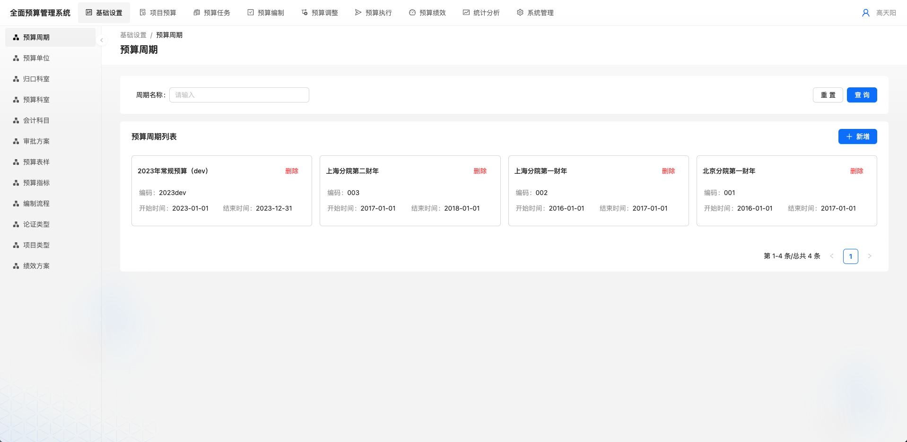
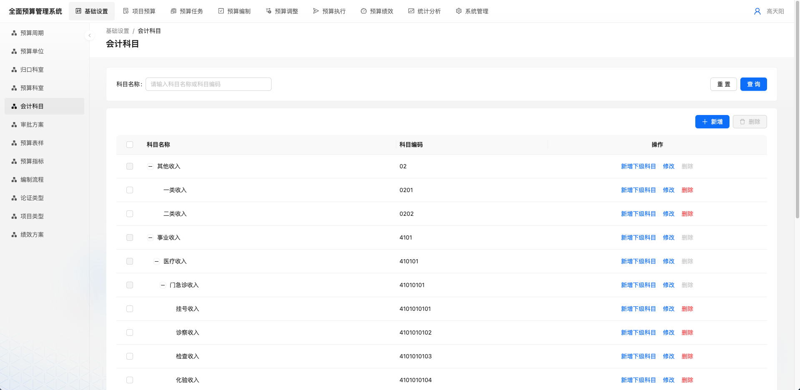
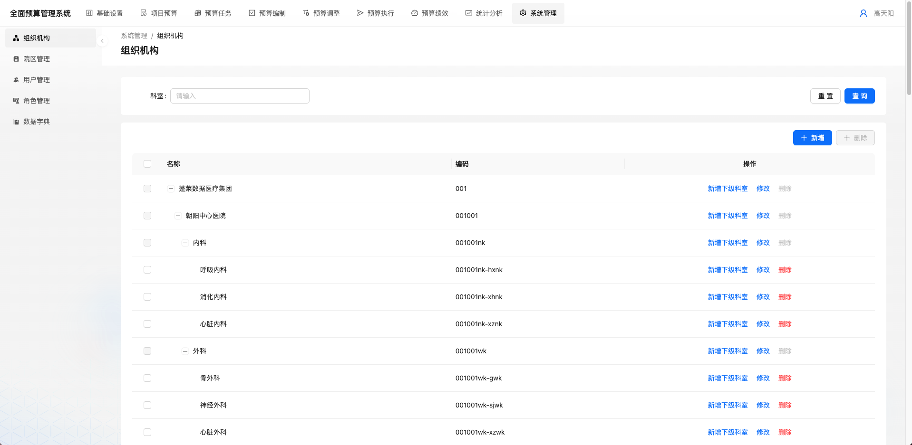
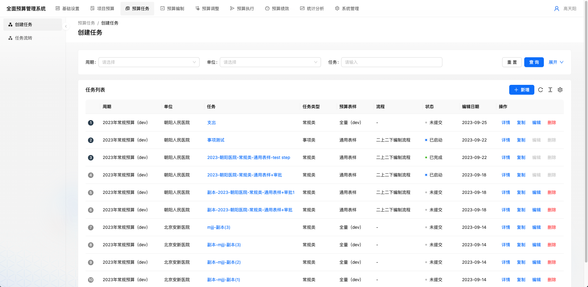
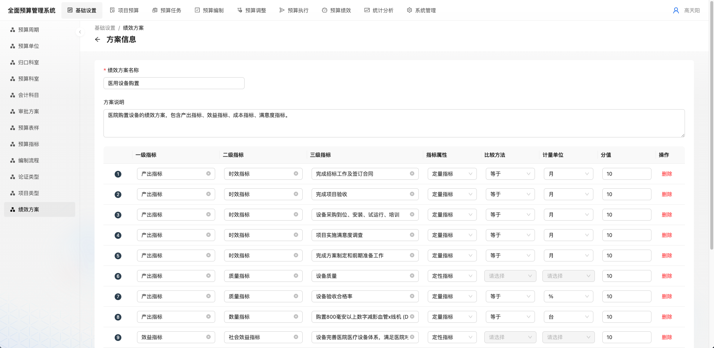

# cbms 技术栈

1. Antd ProList 实现[数据卡片](packages/setting-ui/src/routes/period/components/smpList.tsx)
   
   
   1. 数据超长缩略
   2. 空数据处理
2. Antd ProTable 实现[树形列表](packages/setting-ui/src/routes/account/components/accountList.tsx)
   
   
   1. 存在子集复选、操作按钮禁用
   2. 未勾选复选框 公共操作按钮禁用
3. Antd ProTable 实现标准表格
   
4. editable-table 实现[可编辑表格](packages/setting-ui/src/routes/performance/components/performanceForm.tsx)
   
   1. 数据联动编辑 指标属性=>比较方法=>计量单位
   2. 多行数据存储删除 `array.filter()`
