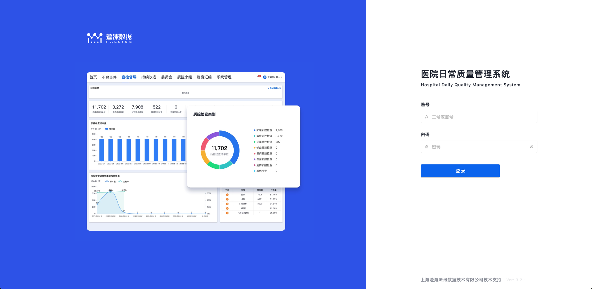
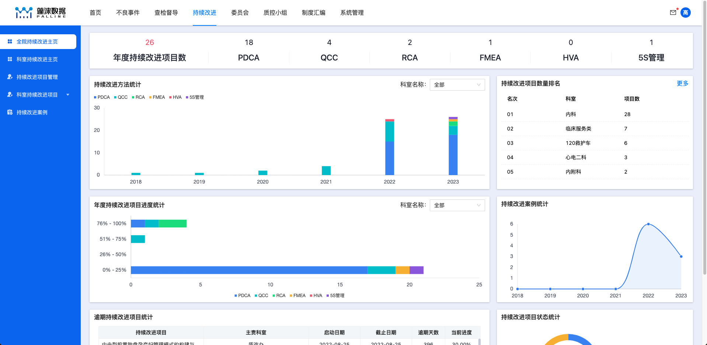
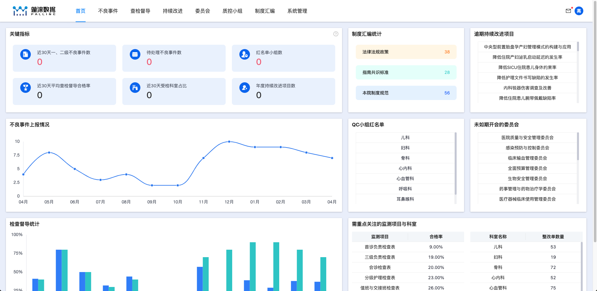
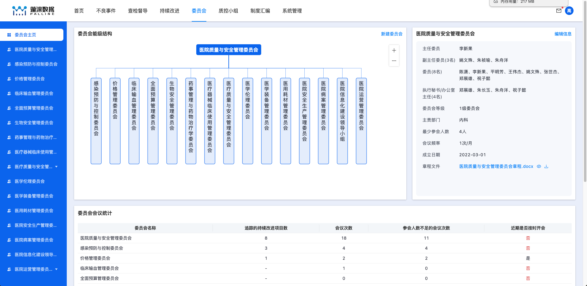
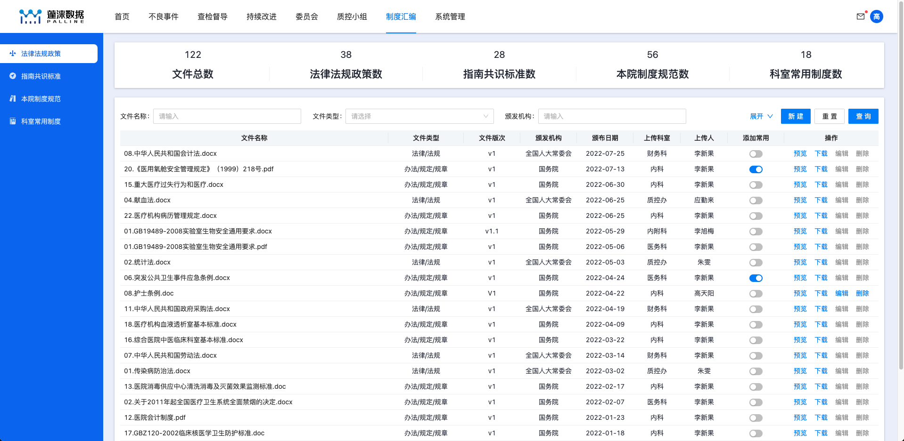
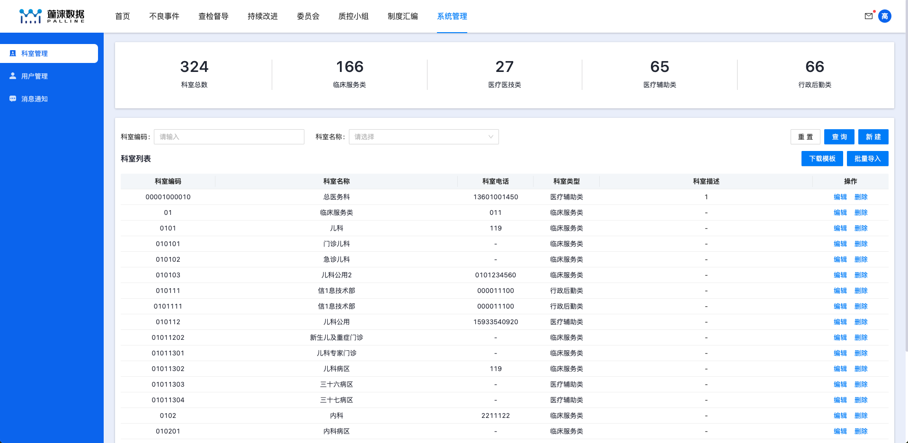
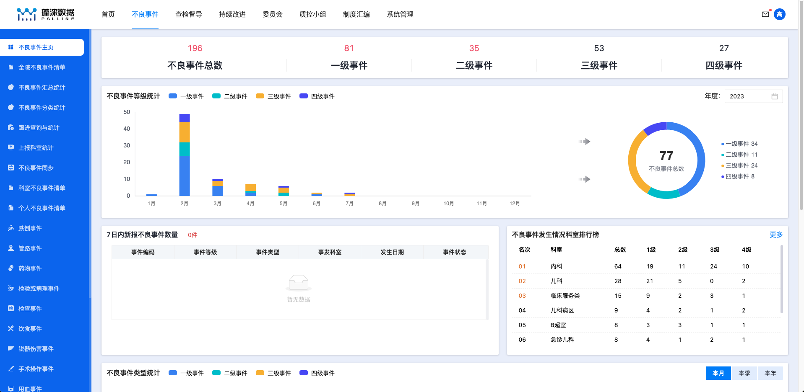
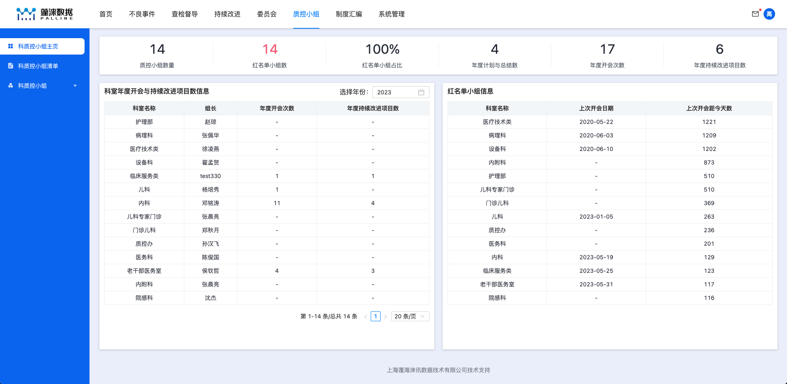

# dhqs 技术栈

1. rc-banner-anim 实现 login 幻灯片效果
   
   <!--  -->
2. cloud-charts 实现图表
   
   
3. organization-graph 实现组织架构
   
   1. 组织架构与菜单联动 动态生成顶级 root 节点
4. Antd pro-components 实现标准表格
   
   
5. 封装顶部[数据统计条](packages/adverse-event-ui/src/routes/statistics/reportDept/topStatistics/index.tsx)组件 并支持多种格式展示
   
   
   1. 大小数据量展示
   2. 标红数据处理
