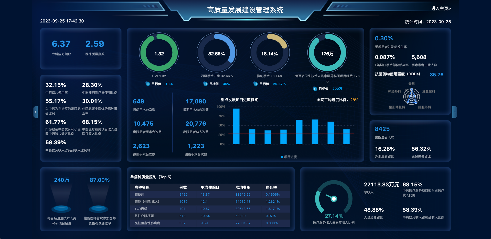
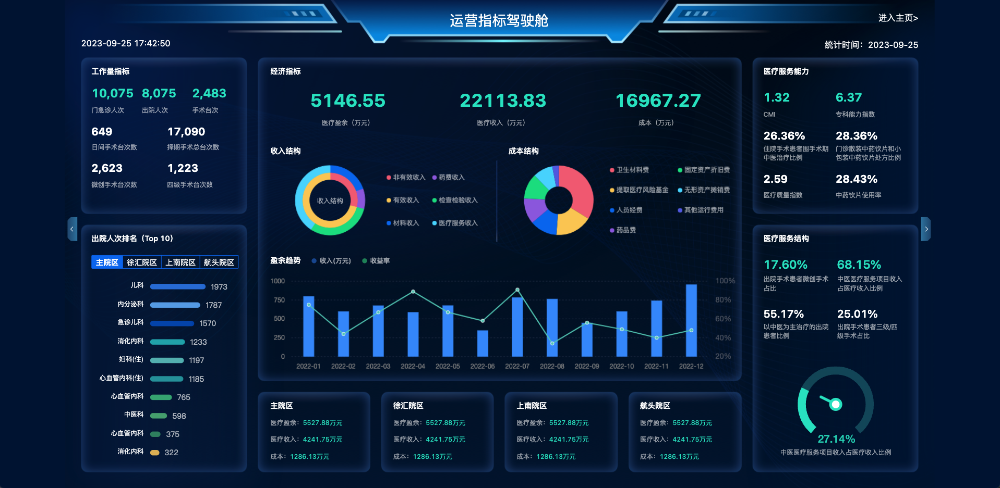
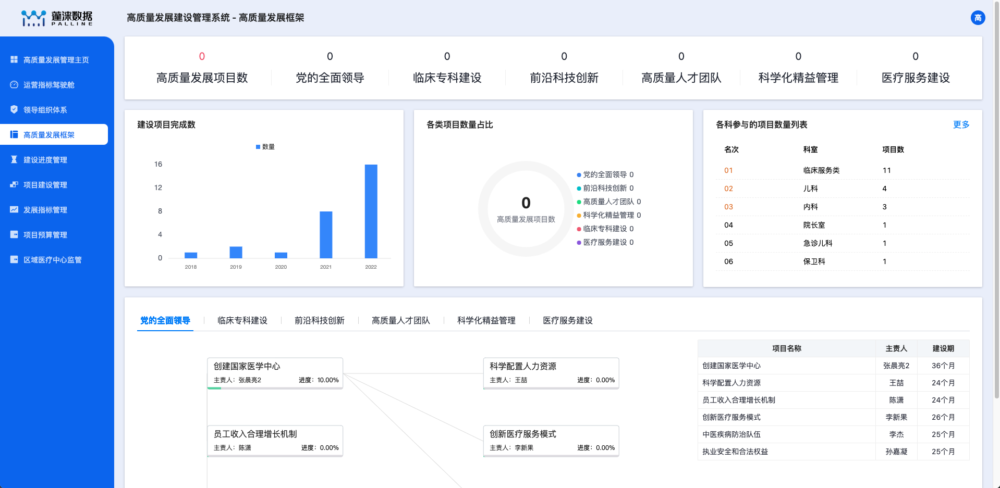
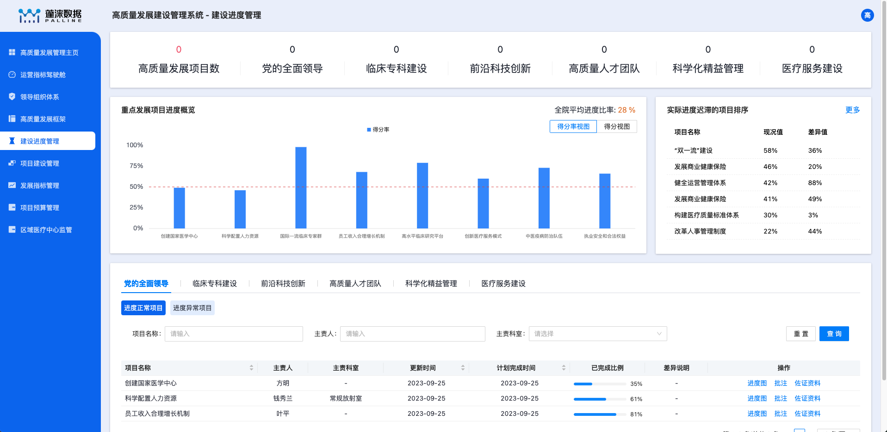
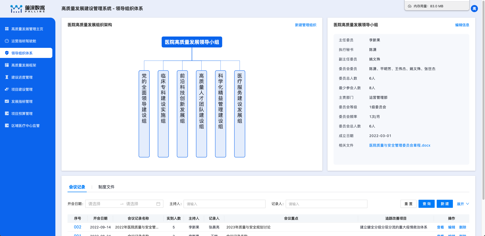
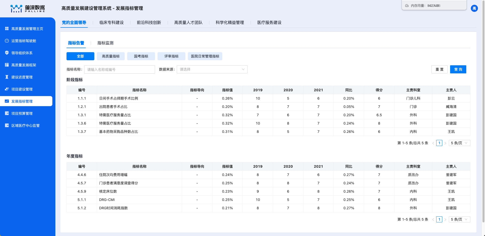
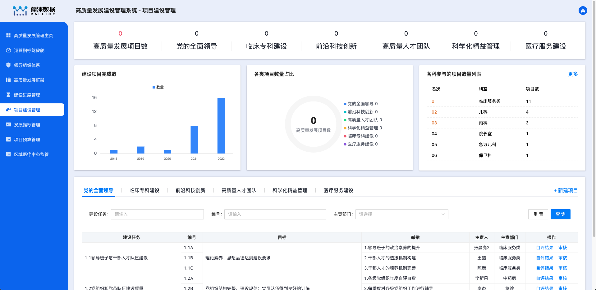

# pmp 技术栈

1. tgg-large-screen 实现数据大屏全屏缩放效果
   
2. react-transition-group 实现数据大屏横向切换效果
   
   1. 使用 location 承接 `trend` 标记滚动方向
   2. 使用 CSSTransition 实现横向滚动特效
   3. 横屏切换加载时添加 load 效果，避免白屏
3. cloud-charts 实现图表
   
   
4. organization-graph 实现组织架构
   
5. Antd pro-components 实现标准表格
   
6. 封装顶部数据统计条组件 并支持多种格式展示
   
   1. 大小数据量展示
   2. 标红数据处理
