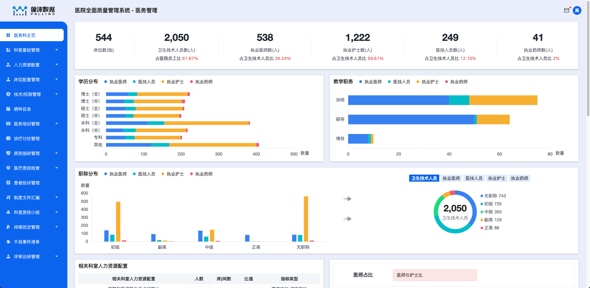

# qms 技术栈

1. 3D card 实现九宫格卡片交互效果
   
   1. [3D card - 卡片交互效果](https://codepen.io/robin-dela/pen/jVddbq)
   2. [Flippable Playing Cards - 卡片交互效果](https://codepen.io/smpnjn/pen/qBVPvpZ)
2. tgg-large-screen 实现数据大屏全屏缩放效果
   
3. react-transition-group 实现数据大屏横向切换效果
   
   1. 使用 location 承接 `trend` 标记滚动方向
   2. 使用 CSSTransition 实现横向滚动特效
   3. 横屏切换加载时添加 load 效果，避免白屏
4. [cloud-charts](https://cloud-charts.gitee.io/example/Recommendation) 实现图表
   
   
   
   1. 使用 Wline 实现折线图
   2. 使用 Wbar 实现柱图
   3. 使用 Wpie 实现环图
   4. 使用 Wlinebar 实现线柱图
   5. 使用 Wnightingale 实现玫瑰图
5. organization-graph 实现组织架构
   
6. Antd pro-components 实现标准表格
   
   
   
7. 封装顶部数据统计条组件 并支持多种格式展示
   
   
   
   1. 大小数据量展示
   2. 标红数据处理
8. 使用 [formilyjs](https://designable-antd.formilyjs.org/) 实现表单
   
   
